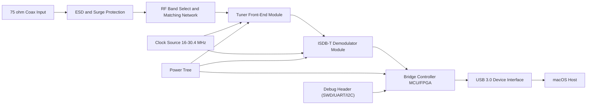
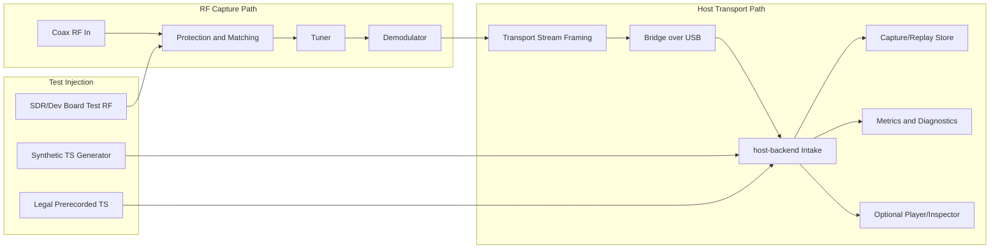
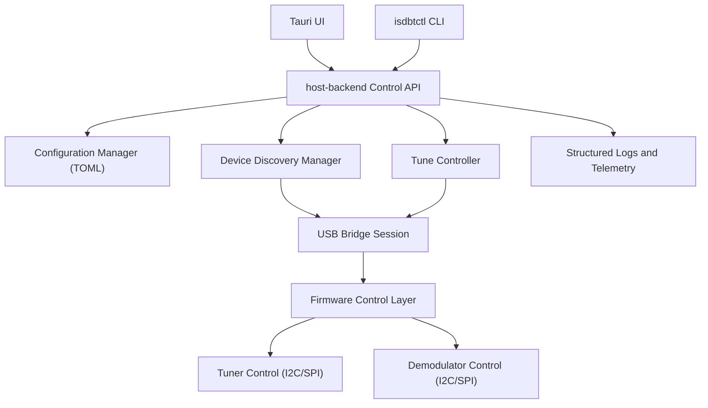
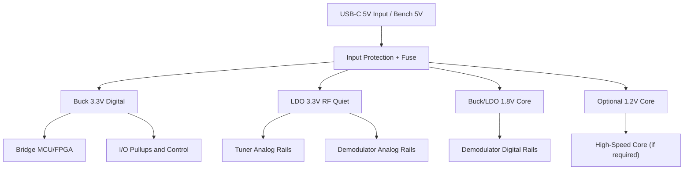
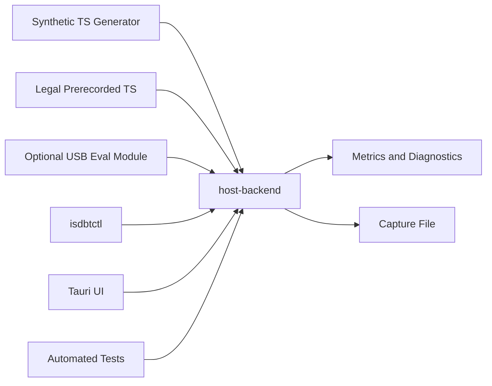
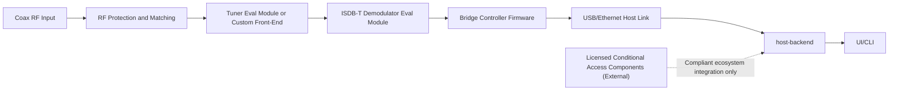
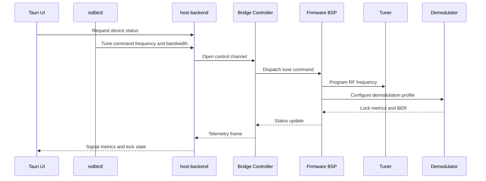

# Block Diagrams

This document provides explicit diagrams for hardware, signal flow, control flow, power architecture, runtime modes, and hardware/software interaction.

## 1. Top-Level Hardware Block Diagram

## 2. Signal Path Diagram

## 3. Control Path Diagram

## 4. Power Tree Diagram

## 5. Lab Demo Mode Diagram

## 6. Real RF Integration Mode Diagram

## 7. Hardware/Software Interaction Diagram

Source files are mirrored in [diagrams/](/Users/young/Github/isdbt-rf-front-end-mac-receiver-concept/diagrams).
